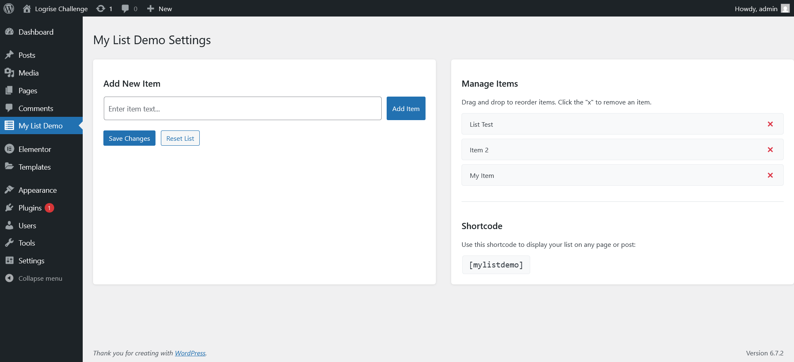

# WordPress List Plugin Challenge

## Table of contents

- [Overview](#overview)
  - [The challenge](#the-challenge)
  - [Screenshots & Demo](#screenshots--demo)
  - [Features](#features)
- [My process](#my-process)
  - [Built with](#built-with)
  - [What I learned](#what-i-learned)
  - [Installation](#installation)

## Overview

This plugin was created as part of a technical challenge by Logrise. The "My List Demo" plugin allows users to add a list of items from the WordPress admin panel and display them on the frontend of the website using a shortcode or an Elementor widget.

### The challenge

Admin Users should be able to:

- Add new items to the list
- Delete items from the list
- Drag and drop to reorder items on the list
- Save changes to the list
- Reset the list to its default state
- Implement security best practices

Frontend Users should be able to:

- View the list of items through a shortcode
- View the list of items through an Elementor widget

### Screenshots & Demo

#### Admin Interface

#### Adding and Reordering Items

#### Editing in Elementor and viewing in Frontend

### Features

- **Admin Panel**
  - Settings page for the plugin
  - Interface to add/remove items from the list
  - Drag-and-drop functionality to reorder items (using jQuery UI Sortable)
  - Implementation of security best practices (nonce verification, capability checks)
  - Option to reset the list

- **Frontend**
  - Shortcode `[mylistdemo]` to display the list
  - Clean and attractive visual styling
  - Responsive design

- **Performance & Integration**
  - Use of WordPress transients to improve performance
  - Integration with Elementor through a custom widget
  - AJAX-based saving and resetting for better user experience

## My process

The development process focused on creating a lightweight yet functional plugin that follows WordPress best practices. I started by setting up the basic plugin structure, then implemented the admin interface with jQuery UI for drag-and-drop functionality. Security was a priority, so I implemented nonce verification and capability checks throughout.

For the frontend, I created a simple but effective shortcode that displays the list items in a clean format. The Elementor integration was added as a bonus feature to provide more flexibility for users who prefer page builders.

### Built with

- PHP 8.4+
- WordPress 6.7+
- jQuery and jQuery UI (for drag-and-drop functionality)
- AJAX for asynchronous data saving
- WordPress Transients API for performance optimization
- WordPress Settings API
- WordPress Shortcode API
- Elementor integration

### What I learned

This project provided valuable experience in:
- Creating maintainable and secure WordPress plugins
- Implementing drag-and-drop functionality with jQuery UI
- Working with WordPress transients for performance optimization
- Integrating with Elementor through custom widgets
- Handling AJAX requests in WordPress

### Installation

1. Download the plugin [zip file](https://github.com/fhvicente/logrisechallenge/raw/main/my-list-demo.zip)
2. Upload it to your WordPress site through the Plugins menu
3. Activate the plugin
4. Go to "My List Demo" in the admin menu to add and manage your list items
5. Use the shortcode `[mylistdemo]` in any post or page to display the list
6. If using Elementor, you can also add the "My List Demo" widget from the widget panel